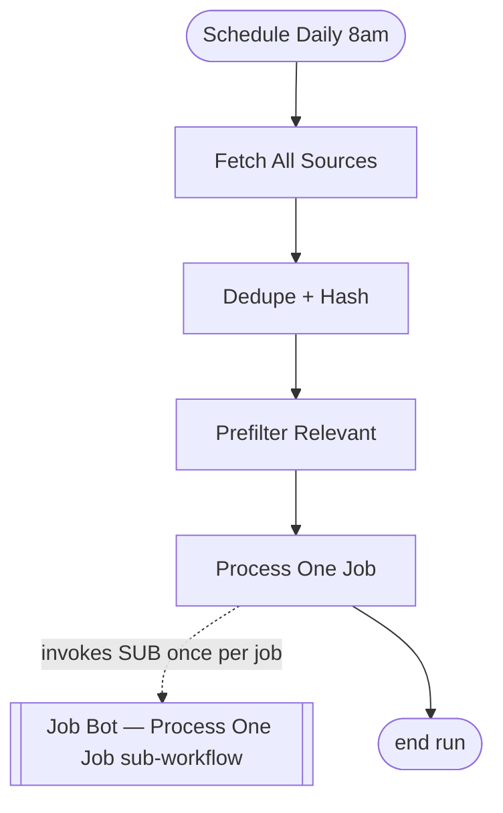
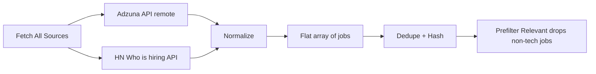
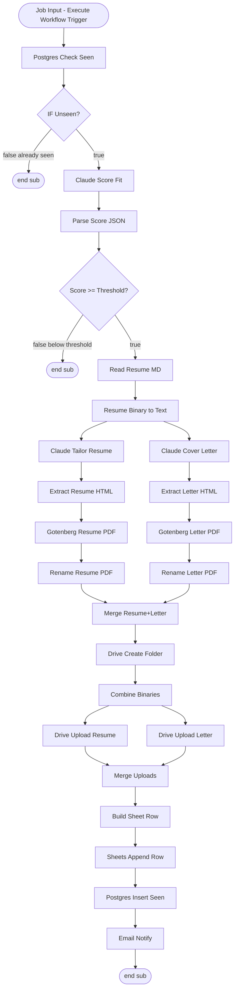
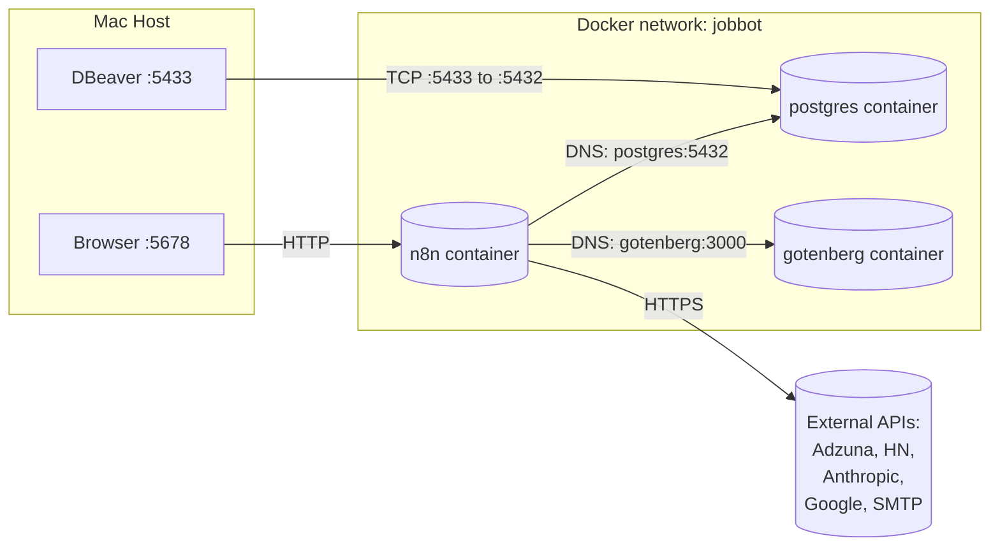
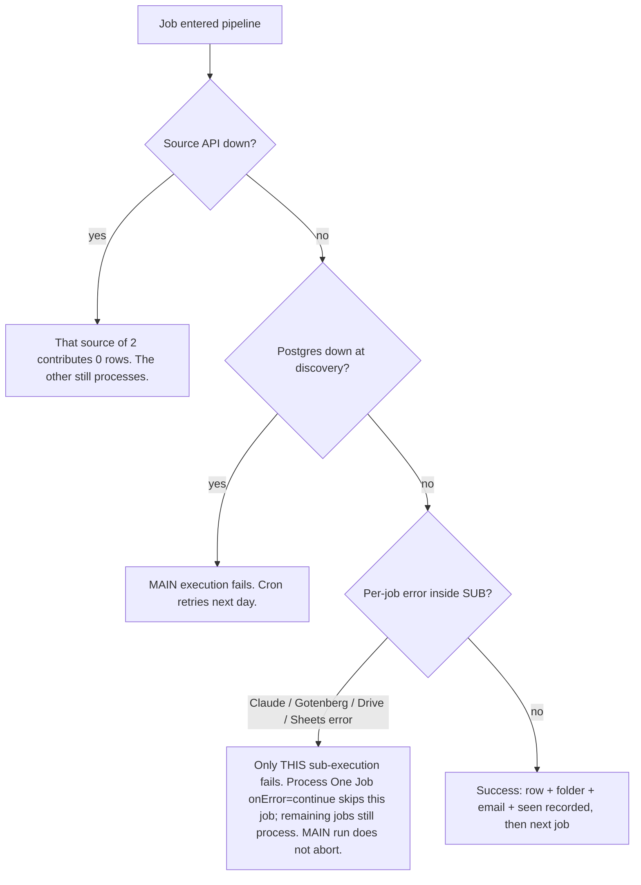

# 05 — Workflow Diagram

This document renders the end-to-end pipeline as Mermaid diagrams. GitHub, GitLab, Obsidian, and most modern Markdown renderers display these natively. VS Code requires the "Markdown Preview Mermaid Support" extension.

## High-Level Flow (MAIN workflow)

The pipeline is split into two workflows. The **MAIN** workflow — "Job Bot — Discover, Tailor, Apply Prep" — is a short linear chain that discovers jobs and then fans them out. Its final node, **Process One Job**, is an Execute Workflow node (mode: each, onError: continue) that invokes the **SUB** workflow once per job.

`Process One Job` runs the sub-workflow once for each job item. Because it is configured `onError: continue`, a failure while processing any single job does not stop the remaining jobs — see Failure Behavior below.

## Source Aggregation Detail

Each source is wrapped in a `try { ... } catch { return [] }` so a single failing API never stops the run. After dedupe, a Prefilter step removes non-tech postings before the jobs are fanned out to the sub-workflow.

## SUB workflow — "Job Bot — Process One Job" (one item)

This is the sub-workflow the MAIN chain invokes once per job. It starts at an Execute Workflow Trigger (Job Input, passthrough) and ends either at Email Notify or at one of the IF-false END nodes. There are **no loopbacks** inside the sub: an IF-false branch or the Email node simply terminates this sub-execution and control returns to the parent, which then moves on to the next job.

## Container Topology

The host reaches n8n on `5678` and Postgres on `5433`. The internal network uses container names as DNS — n8n calls Postgres on `postgres:5432` and Gotenberg on `gotenberg:3000`. All outbound traffic to external APIs goes from the n8n container straight out via Docker NAT.

## Data Flow (logical, not visual)

This logical view is still accurate end-to-end. Note that everything from the `seen_jobs SELECT` onward now executes inside the SUB workflow ("Job Bot — Process One Job"), invoked once per job by the MAIN chain.

```mermaid
flowchart LR
    src[Adzuna + HN APIs] -->|raw JSON| norm[Normalize]
    norm -->|"{source,title,company,...}"| ddp[Dedupe + Hash]
    ddp -->|+ job_hash| pref[Prefilter drop non-tech]
    pref --> pg1[(seen_jobs SELECT)]
    pg1 -->|new only| llm1[Haiku score]
    llm1 -->|+ score,fit,reqs| flt[Threshold filter]
    flt -->|kept| res[resume.html]
    res --> llm2[Sonnet resume HTML]
    res --> llm3[Sonnet letter HTML]
    llm2 --> got1[Gotenberg PDF]
    llm3 --> got2[Gotenberg PDF]
    got1 --> drv1[Drive: resume.pdf]
    got2 --> drv2[Drive: letter.pdf]
    drv1 --> sht[(Sheets append)]
    drv2 --> sht
    sht --> pg2[(seen_jobs UPSERT)]
    pg2 --> mail[SMTP email]
```

## Failure Behavior

There is no automatic retry inside the pipeline, but per-job error isolation is now fixed. Each job runs in its own sub-execution via the `Process One Job` Execute Workflow node (mode: each, onError: continue). If a job errors — a Claude API failure, a Gotenberg timeout, a Drive/Sheets error — only that single sub-execution fails; `onError: continue` skips it and the MAIN run keeps processing the remaining jobs instead of aborting the whole run. The dedupe/upsert design still allows tomorrow's run to re-attempt jobs that errored today, as long as they were not inserted into `seen_jobs` (which only happens at the end of the successful path, inside the sub-workflow).
